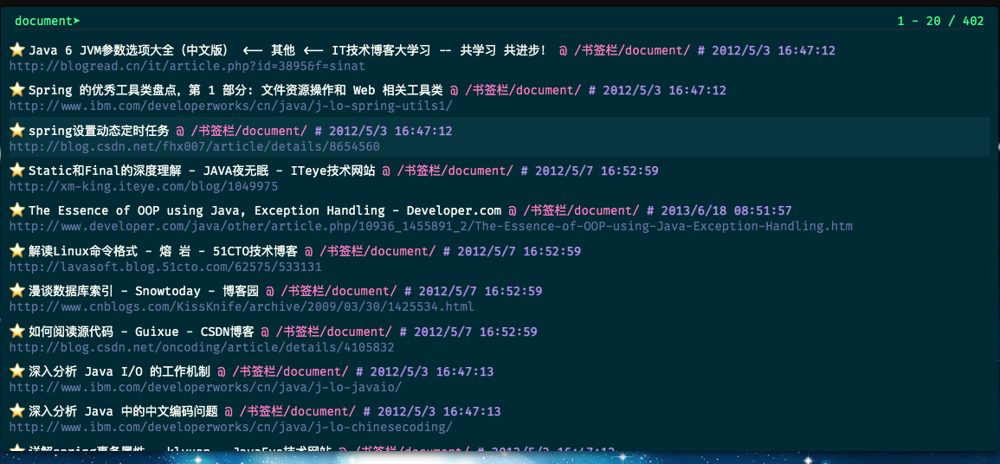

1. config sk_theme color looks like solarized-dark;


2. config settings.omnibarMaxResults=20

3. config registerInlineQuery with dict.youdao.com


4. add addSearchAlias[```fy```]  with dict.youdao.com
